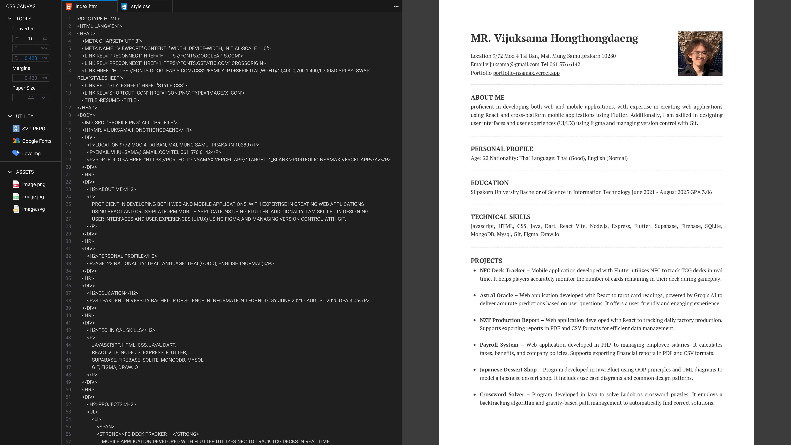

## CSS CANVAS

Web app for creating canvases using HTML and CSS. It allows users to export their work as PDF, PNG, and JPG files. The UI design draws inspiration from VS Code and the print functionality found on websites.

